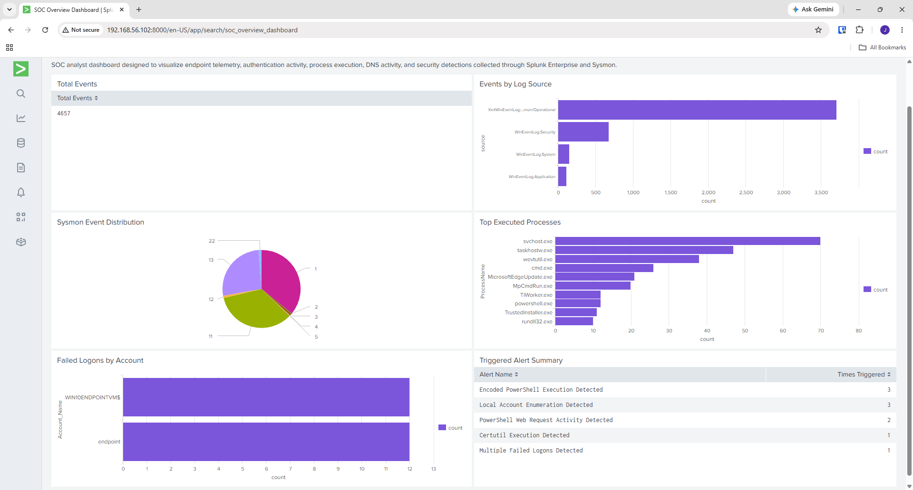

# SOC Dashboard Development

## Overview

Developed a Security Operations Center (SOC) dashboard within Splunk to visualize endpoint telemetry, authentication activity, process execution, log source distribution, and detection activity generated throughout the lab environment.

The dashboard was designed to provide a centralized view of security-relevant events and support rapid analyst visibility into system activity, alert generation, and overall SIEM health.

---

## Dashboard Components

### Total Events

Provides a high-level view of event volume ingested into Splunk, helping validate data collection and monitor overall telemetry growth.

### Events by Log Source

Visualizes the distribution of events across Sysmon, Security, System, and Application logs to verify successful log ingestion and identify the primary sources of security telemetry.

### Sysmon Event Distribution

Displays the frequency of Sysmon event types, providing visibility into process creation, network connections, DNS queries, and other endpoint activity.

### Top Executed Processes

Identifies the most frequently executed processes observed on the monitored Windows endpoint. This visualization helps highlight common system activity and provides visibility into process execution trends.

### Failed Logons by Account

Tracks failed authentication attempts and highlights accounts experiencing repeated logon failures, supporting the identification of potential brute-force or password-spraying activity.

### Triggered Alert Summary

Displays custom detections that generated alert activity during validation testing, providing a consolidated view of detection performance across the environment.

---

## Dashboard Data Sources

The dashboard was built using custom SPL searches against Sysmon and Windows Event Log telemetry collected from the Windows 10 endpoint.

Key searches included:

* Event volume monitoring using index-wide event counts
* Log source distribution analysis
* Sysmon Event ID distribution
* Process creation analysis (Sysmon Event ID 1)
* Failed authentication monitoring (Windows Event ID 4625)
* Detection activity monitoring through Splunk scheduler logs

Dashboard visualizations were generated using SPL aggregation and transformation commands including:

* `stats`
* `sort`
* `head`
* `eval`
* `replace`

These searches transformed raw endpoint telemetry into analyst-friendly visualizations that support monitoring and investigation workflows.

---

## Dashboard Tuning

Several dashboard panels were refined to improve visibility and reduce noise.

### Process Execution Tuning

Initial process execution visualizations were dominated by Splunk Universal Forwarder monitoring processes, including:

* splunk-powershell.exe
* splunk-regmon.exe
* splunk-netmon.exe
* splunk-admon.exe

Because these processes were generated by the logging infrastructure itself rather than endpoint user activity, they obscured meaningful process execution trends.

To improve analyst visibility, Splunk Universal Forwarder processes were excluded from the visualization. This allowed endpoint activity such as PowerShell, Command Prompt, Windows services, Microsoft Defender, and other system processes to be more clearly identified.

### Authentication Visualization

Failed logon testing generated both user and machine account authentication events. While expected in a Windows environment, machine account activity can introduce noise into authentication-focused visualizations.

In a production environment, additional tuning would be performed to suppress known machine-account activity and improve analyst visibility into user authentication failures.

---

## Dashboard

---

## Key Takeaways

* Built a centralized SOC dashboard using Splunk visualizations and custom SPL searches.
* Developed operational visibility into endpoint telemetry collected through Sysmon and Windows Event Logs.
* Applied dashboard tuning techniques to reduce logging infrastructure noise and improve data quality.
* Created visualizations for process execution, authentication activity, event distribution, and detection monitoring.
* Gained hands-on experience presenting security telemetry in an analyst-friendly format.
* Improved understanding of how dashboards support monitoring, triage, and security operations workflows.

The completed dashboard provides a consolidated view of endpoint activity and detection performance, transforming raw telemetry into actionable security insights for security analysts.

